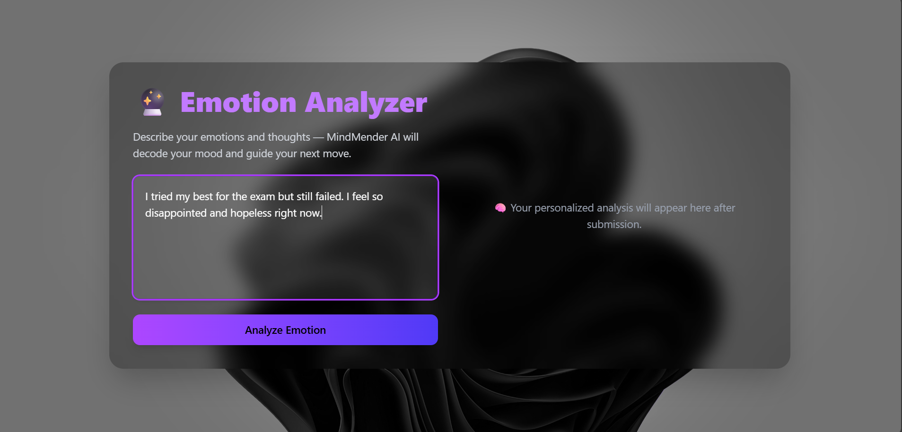
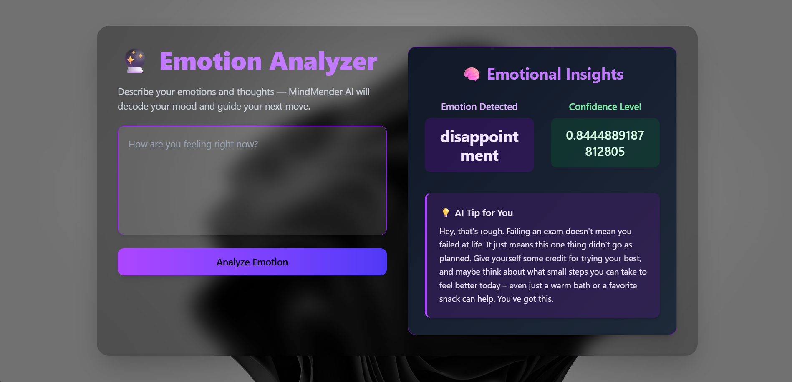

# 🧠 Emotion Analyzer


A fullstack AI-powered mental health journal that detects emotions and gives personalized wellness tips.


---


## 📌 Overview


This project uses:

- Spring Boot for backend API

- FastAPI with Hugging Face + Gemini for emotion analysis

- React + Vite + Tailwind for the frontend


---


## 📂 Folder Structure


emotion-analyzer/

├── Backend-springboot/

├── ML-model-PY/

├── Front-End-React-vite/


---


## 🚀 How It Works


1\. User enters their thoughts

2\. Backend sends it to Python ML service

3\. Hugging Face detects emotion

4\. Gemini generates a friendly mental health tip

5\. Response shown beautifully on UI


---

## 📸 App Screenshots


Get a quick look into how \*\*MindMender - Emotion Analyzer\*\* works with our intuitive UI and real-time emotion feedback.


## 🖼️ Screenshots


### 🏠 Home Page

> Introducing MindMender with an elegant UI and clear call-to-action.


---


### 🧠 Emotion Request
### 📝 Analyze Page

> Users can enter their current emotional state using natural language.





---


### 📊 AI Response Output
> The system returns detected emotion, confidence level, and a helpful AI-generated tip.





---


### ℹ️ Informational Section

> Why use MindMender? Learn how our AI-powered insights work to support your emotional well-being.


---


## 🔧 How to Run


### 1. Clone the project


```bash

git clone https://github.com/rohanmandal341/emotion-analyzer.git

cd emotion-analyzer

```

##2. Run Python ML Server (FastAPI)


```bash
cd ML-model-PY

pip install -r requirements.txt

```

python app.py

➡️ Add your Gemini API key in .env.local:
```env
api_key=YOUR\_GEMINI\_API\_KEY
```


## 3. Run Spring Boot Backend

```bash

cd Backend-springboot

./mvnw spring-boot:run

```

## 4. Run Frontend (React + Vite)
```bash
cd Front-End-React-vite

npm install

npm run dev
```
---
## 🧠 Powered By

Hugging Face RoBERTa (Emotion Classification)

Google Gemini (AI Tips)

Spring Boot, FastAPI, React, Tailwind CSS
---
## ✅ License

MIT – Free to use and modify

